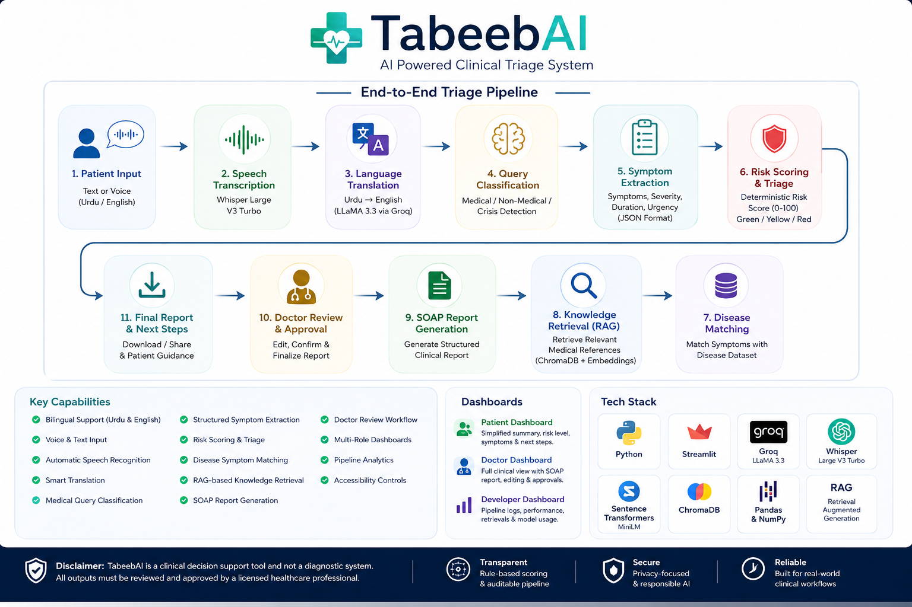

<h1>TabeebAI</h1>

 

AI Powered Clinical Triage System for Urdu and English Speaking Patients

 

 

  

<h2>Overview</h2>
 

TabeebAI is a clinical decision support system designed to assist healthcare providers in performing rapid, structured patient triage in both Urdu and English.

  

<h2>Key Features</h2>
 

<ul>
<li><b>Bilingual Input Handling</b> — accepts patient statements in Urdu or English, through text or audio, with automatic language detection.</li>
<li><b>Speech Transcription</b> — converts recorded or uploaded patient audio into text using Whisper Large V3 Turbo.</li>
<li><b>Automatic Translation</b> — Urdu input is translated into clinical English before downstream processing, while preserving medical meaning.</li>
<li><b>Query Classification</b> — every statement is classified as medical, non medical, or a mental health crisis before triage continues, with crisis cases routed directly to support resources.</li>
<li><b>Structured Symptom Extraction</b> — extracts chief complaint, individual symptoms, severity, duration, and urgency level in a strict JSON schema.</li>
<li><b>Risk Scoring Engine</b> — a deterministic scoring model combines urgency level, symptom severity, emergency keyword detection, and symptom count into a 0 to 100 risk score, mapped to Green, Yellow, or Red triage levels.</li>
<li><b>Disease Symptom Matching</b> — extracted symptoms are matched against a structured disease symptom dataset to surface statistically likely conditions.</li>
<li><b>Retrieval Augmented Knowledge</b> — a sentence embedding model retrieves the most relevant medical reference passages to ground the generated report in factual context.</li>
<li><b>SOAP Report Generation</b> — produces a complete Subjective, Objective, Assessment, and Plan report formatted for clinical use.</li>
<li><b>Human in the Loop Review</b> — physicians can edit, confirm, and sign off on generated reports before they are finalized or downloaded.</li>
<li><b>Multi Dashboard Interface</b> — separate views for patients, doctors, and developers, each tailored to its audience.</li>
<li><b>Pipeline Observability</b> — full visibility into stage by stage execution time, retrieved knowledge chunks, disease matches, and model usage for debugging and audit purposes.</li>
<li><b>Accessibility Controls</b> — adjustable font scaling for readability across different users.</li>
</ul>

  

<h2>How It Works</h2>
 

<ol>
<li>Patient input is received as typed text or recorded or uploaded audio.</li>
<li>If audio is provided, it is transcribed using Whisper and the resulting language is detected.</li>
<li>If the input is Urdu, it is translated into English using a Groq hosted LLaMA model.</li>
<li>The translated statement is classified as medical, non medical, or crisis.</li>
<li>Medical statements proceed to structured symptom extraction in JSON format.</li>
<li>A deterministic risk score and triage level are computed from the extracted data.</li>
<li>Extracted symptoms are matched against a disease symptom dataset to identify probable conditions.</li>
<li>Relevant medical knowledge passages are retrieved using sentence embedding similarity search.</li>
<li>A SOAP formatted clinical report is generated using the extracted data and retrieved context.</li>
<li>The report is presented to the physician for review, editing, and confirmation before being finalized.</li>
</ol>

  

<h2>Dashboards</h2>
 

<b>Patient Dashboard</b> 
Presents a simplified summary of the triage outcome, including risk level, identified symptoms, chief complaint, and clear next step instructions written for a non clinical audience.

  

<b>Doctor Dashboard</b> 
Provides the full clinical picture, including the SOAP report with editing and sign off controls, detailed symptom breakdown, disease matching results, and retrieved reference knowledge.

  

<b>Developer Dashboard</b> 
Exposes pipeline execution status, stage by stage timing breakdowns, raw JSON output, retrieval debug information, and the specific models used at each stage of the pipeline.

  

<h2>Risk Scoring Logic</h2>
 

Risk is calculated using a weighted, rule based model rather than a black box prediction, which keeps the scoring transparent and auditable.

<ul>
<li>Base score is assigned according to extracted urgency level.</li>
<li>Additional points are added based on the severity of each reported symptom.</li>
<li>A fixed bonus is applied if known emergency keywords are detected in either English or Urdu.</li>
<li>A small additional weight is applied based on total symptom count.</li>
<li>The final score is capped at 100 and mapped to a Green, Yellow, or Red triage category.</li>
</ul>

  

<h2>Tech Stack</h2>
 

<table align="center">
<tr>
<th>Layer</th>
<th>Technology</th>
</tr>
<tr>
<td>Frontend and Application Framework</td>
<td>Streamlit</td>
</tr>
<tr>
<td>Language Model Inference</td>
<td>Groq API, LLaMA 3.3 70B Versatile, LLaMA 3.1 8B Instant</td>
</tr>
<tr>
<td>Speech Transcription</td>
<td>Whisper Large V3 Turbo</td>
</tr>
<tr>
<td>Embeddings and Retrieval</td>
<td>Sentence Transformers, all MiniLM L6 v2</td>
</tr>
<tr>
<td>Data Processing</td>
<td>Pandas, NumPy</td>
</tr>
<tr>
<td>Core Language</td>
<td>Python</td>
</tr>
<tr>
<td>Deployment</td>
<td>Streamlit Community Cloud</td>
</tr>
</table>

  

<h2>Project Structure</h2>
 

<pre>
tabeeb/
├── app.py                     Main Streamlit application and pipeline logic
├── data/
│   ├── diseases_symptoms.csv  Disease and symptom reference dataset
│   └── medical_knowledge.json Knowledge base used for retrieval augmented generation
├── assets/
│   ├── logo.png                Application logo
│   └── agahi_logo.png          Organization logo
├── requirements.txt            Python dependencies
└── README.md                   Project documentation
</pre>

  

<h2>Installation</h2>
 

Clone the repository.

<pre>
git clone https://github.com/hamaylzahid/tabeeb.git
cd tabeeb
</pre>

Create and activate a virtual environment.

<pre>
python -m venv venv
venv\Scripts\activate        for Windows
source venv/bin/activate     for macOS or Linux
</pre>

Install the required dependencies.

<pre>
pip install -r requirements.txt
</pre>

Set the Groq API key as an environment variable.

<pre>
export GROQ_API_KEY=your_api_key_here      for macOS or Linux
set GROQ_API_KEY=your_api_key_here         for Windows
</pre>

Run the application.

<pre>
streamlit run app.py
</pre>

  

<h2>Usage</h2>
 

<ol>
<li>Open the application in a browser using the local or deployed URL.</li>
<li>Select Text Input or Audio Input from the sidebar.</li>
<li>Enter patient symptoms in Urdu or English, or record or upload a voice statement.</li>
<li>Click Analyze to run the full triage pipeline.</li>
<li>Review the risk level, generated SOAP report, and recommended next steps in the relevant dashboard.</li>
<li>Doctors may edit and confirm the SOAP report before downloading it in text or markdown format.</li>
</ol>

  

<h2>Live Demo</h2>
 

  

  

<h2>Disclaimer</h2>
 

TabeebAI is a clinical decision support tool. It is not a diagnostic system and must not be used as a substitute for professional medical judgment. All AI generated outputs, including risk scores and SOAP reports, must be reviewed and approved by a licensed healthcare professional before being used for any clinical decision. In cases of suspected medical emergency, contact local emergency services immediately.

  

<h2>License</h2>
 

This project is released under the MIT License. See the LICENSE file in the repository for full terms.
